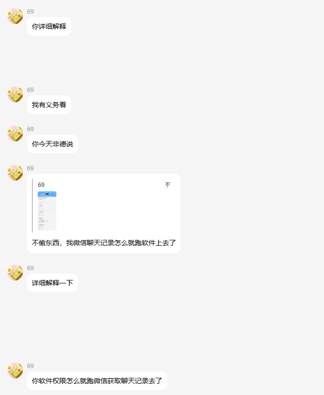
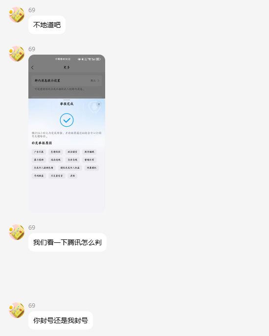
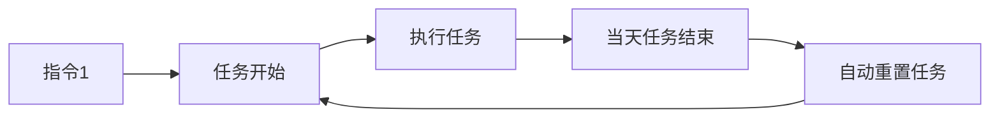
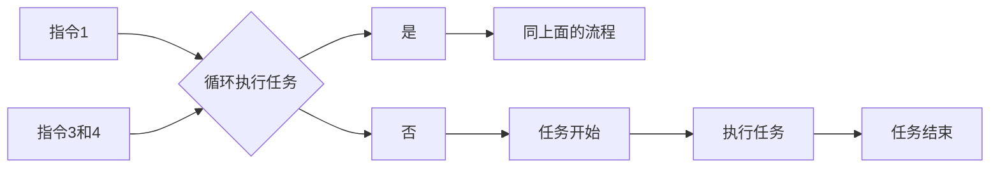

# DailyTask

> 基于 Kotlin 开发的 Android 无人值守打卡工具，兼容 Android 8 ~ 16 及 HarmonyOS
> 4.0，其他OS需要自行测试，理论上能安装就能用，但不保证兼容性，需注意！

---

## 目录

- [许可证与授权说明](#许可证与授权说明)
- [隐私与权限说明](#隐私与权限说明)
- [软件介绍](#软件介绍)
- [重要限制](#重要限制)
- [最新版本](#最新版本)
- [版本更新日志](CHANGELOG.md)
- [争议说明](#争议说明)
- [快速开始](#快速开始)
- [远程指令](#远程指令)
- [通信机制](#通信机制)
- [打卡结果说明](#打卡结果说明)
- [常见问题与风险](#常见问题与风险)
- [社区支持](#社区支持)

---

## 许可证与授权说明

- 本项目以 **PolyForm Noncommercial License 1.0.0** 发布，仅供**非商业用途**的学习与研究，
  禁止任何商业使用、倒卖或二次售卖。
- 软件完全本地运行，不含服务端，不收集或上传任何用户数据。
- 软件按「现状」提供，作者不对使用过程中产生的任何后果承担责任。
- 商业使用或授权事宜，请联系作者另行协商。

> 由于存在倒卖行为，GitHub 不再提供预编译安装包。有编译能力者可自行从源码构建；
> 否则请加入 QQ 群获取安装包。

### 隐私与权限说明

- 本软件**完全本地运行**，不含服务端备份，不存在隐私泄露或数据窃取风险。
- 远程指令功能需监听 QQ、微信等即时通讯软件的消息（建议使用小号）。若介意此功能，请勿使用。
- 使用前请仔细阅读本文档，确保您已充分了解软件的功能和限制。

---

## 软件介绍

| 序号 | 说明                                                          |
|:--:|:------------------------------------------------------------|
| 1  | 将一部备用手机置于公司工位，设置上下班打卡时间即可实现定时自动打卡。                          |
| 2  | 兼容 **Android 8.0 ~ 16.0** 以及 **HarmonyOS 4.0**；小米澎湃系统请自行测试。 |
| 3  | 本项目原为个人自用工具，因换工作后不再使用，故选择开源，欢迎提 Issue 或 PR。                 |
| 4  | **无人值守方案**：不修改任何签到软件的内部逻辑，也不修改手机 GPS 位置。                    |
| 5  | 欢迎通过 PR 贡献代码，或通过 QQ 群反馈功能建议。                                |

### 重要限制

| 序号 | 说明                                                                  |
|:--:|:--------------------------------------------------------------------|
| 1  | **手机不可灭屏**：灭屏状态下前台通知服务可能被系统回收，导致无法正常打卡。部分手机锁屏后再解锁不会直接进入桌面，同样会影响打卡。  |
| 2  | 按音量 **减小键** 可开启伪装灭屏模式（不影响打卡），再次按下退出；也可通过**上下滑动屏幕**手势切换。             |
| 3  | 默认每日执行打卡任务，可通过 `DT#关闭循环` 指令远程暂停（需大号给小号发送指令，支持 QQ / 微信 / 支付宝 / TIM）。 |
| 4  | 正式使用前建议先测试几天，确认稳定后再投入实际使用。                                          |

---

## 最新版本

**2.4.1.0** — *2026-06-22*

- 优化主界面时间显示与屏幕常亮
- 修复远程倒计时器管理与上下文引用问题
- 优化节假日调休检测日志处理逻辑
- 重构任务调度逻辑，提升代码可读性与可维护性
- 修复截屏资源初始化与释放问题

[//]: # (> 完整变更请查看 [版本更新日志 &#40;CHANGELOG&#41;]&#40;CHANGELOG.md&#41;)

---

## 争议说明

曾有人无端质疑本项目会窃取隐私、盗取数据。以下为相关聊天记录的截图，借此澄清：

- 本软件完全本地运行，无服务器，不收集、不传输任何用户数据。
- 质疑之前请先了解软件的基本原理，不要靠凭空臆测做判断。

> 如果哪天这个项目停止维护了，大概就是因为这种人多了。各自珍重。

---

## 快速开始

> **前提：目标打卡应用必须支持极速打卡，且已开启该功能。**

### 1. 权限配置

1. 打开 `DailyTask`，应用会自动检测悬浮窗权限，授权即可。
2. 进入手机 **设置 → 通知中心**，找到 `DailyTask`，开启通知权限。
3. 在 `DailyTask` 设置中选择**结果来源**：
    - `通知监听`（仅适用于钉钉）
    - `截屏服务`（理论上适用于任何打卡应用）
4. 开启**通知监听**权限（若未开启，开关底部会显示红色提示文字）。
5. 若钉钉无法监听到打卡结果，或使用飞书、企业微信等不产生打卡通知的应用，请**开启截屏服务**
   ，弹窗中选择「整个屏幕」即可。

### 2. 消息渠道配置

**企业微信**

1. 登录企业微信，创建群聊（可用小号），群聊成员必须都是企业微信用户，否则没有右上角的“设置”功能。
2. 进入群聊设置 → 消息推送 → 配置名称，复制 `webhook 地址` 并保存。
3. 将 `webhook 地址` 末尾的 key 值填入 `DailyTask` 的企业微信渠道配置中。

**QQ 邮箱**

- 填写发件箱地址、SMTP 授权码（**非邮箱密码**）及收件箱地址。
- 发件箱和收件箱可使用同一邮箱。

### 3. 验证

- 配置好消息渠道并开启截屏服务后，可使用「截屏测试」验证服务和消息渠道是否正常工作。
- 若需通过 QQ / TIM / 微信 / 支付宝唤起目标应用打卡，可使用「唤起测试」验证权限。

---

## 远程指令

> 默认每日自动打卡，无需额外操作。以下指令用于远程控制任务执行。
>
> **指令格式**：所有远程指令必须以固定前缀 `DT#` 开头（例如 `DT#执行任务`），否则会被当作普通聊天消息忽略，避免日常对话误触发。

| 序号 | 指令        | 功能                         | 邮件通知 |
|:--:|:----------|:---------------------------|:----:|
| 1  | `DT#执行任务` | 启动循环任务（默认每天自动执行）           |  否   |
| 2  | `DT#终止任务` | 停止循环任务（仅停止当天）              |  否   |
| 3  | `DT#开启循环` | 开启循环标志位                    |  是   |
| 4  | `DT#关闭循环` | 关闭循环标志位（永久暂停，直到收到指令 3）     |  是   |
| 5  | `DT#息屏`   | 开启伪装灭屏模式                   |  否   |
| 6  | `DT#亮屏`   | 退出伪装灭屏模式                   |  否   |
| 7  | `DT#考勤记录` | 导出当天考勤记录                   |  是   |
| 8  | `DT#打卡`   | 触发一次打卡（默认指令文案为「打卡」）        |  否   |
| 9  | `DT#状态查询` | 查询当前状态（任务、服务、监听、电量、版本、日期等） |  是   |
| 10 | `DT#截屏`   | 截取目标应用屏幕并通过消息渠道返回          |  是   |

### 任务流程

**默认模式（每日自动打卡）：**

**循环控制模式（通过指令 1、3、4 控制任务日期）：**

---

## 通信机制

---

## 打卡结果说明

|   结果   | 说明                                                                             |
|:------:|:-------------------------------------------------------------------------------|
| **成功** |                                                    |
| **失败** | 可能原因： 1. 账号被另一台设备挤下线 2. 未设置极速打卡 3. 应用打卡通知或手机通知被关闭 4. 当前设备登录了两个以上账号 |

---

## 常见问题与风险

### 可能被检测为作弊的情况

| 序号 | 原因                | 风险等级 |
|:--:|:------------------|:----:|
| 1  | 手机已 Root          |  极高  |
| 2  | 使用模拟定位软件修改打卡位置    |  极高  |
| 3  | 使用向日葵等远程控制软件      |  极高  |
| 4  | 使用 ADB 命令模拟手指点击打卡 |  极高  |
| 5  | 开启了无障碍服务          |  中等  |
| 6  | 手机通过数据线连接电脑       |  中等  |

### 其他注意事项

- 使用前请务必仔细阅读本文档所有内容。
- 如本文档未涵盖您的问题，请加入 QQ 群咨询。
- 若未来项目停止维护，敬请谅解。

---

## 社区支持

|    群号     |  容量   | 备注 |
|:---------:|:-----:|:---|
| 560354109 | 200 人 | ①群 |
| 643595483 | 500 人 | ②群 |
| 377923252 | 500 人 | ③群 |